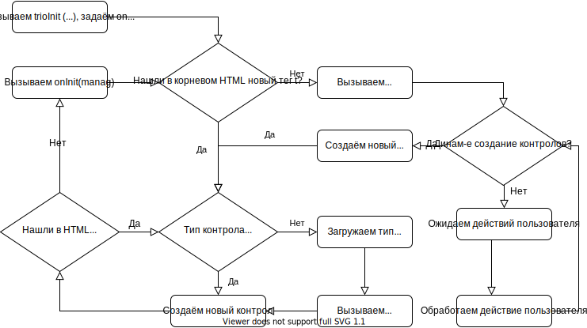

# Схема работы

1. [Последовательность обработки](##-1.-Последовательность-обработки)
1. [Функции обратного вызова](##-2.-Функции-обратного-вызова)
1. [Функция `onInitEnd(manag)`](###-3.-Функция-`onInitEnd(manag)`)

## 1. Последовательность обработки

1. Сохраняем полученную из функции trio.init(path, func) функцию onInitEnd
1. Далее в цикле по полученному узлу разметки ищем место объявления контрола (тег `t`)

    1. В теге ищем объявленный тип

        - Если не нашли тип, то асинхронно загружаем его по HTTP и вызываем функцию `onCreate`, которая возвращает функцию `onInit` для вызова при создании контрола

    1. Асинхронно (из загрузки типа) или сразу (если тип уже был загружен) вызываем функцию `onInit` для создания инстанса

        - Создаём контрол, вызываем функцию `onInit(manag)` для его типа и сохраняем полученный из неё объект `manag`
        - Переходим к п.2 для поиска дочерних контролов текущего

1. Если все контролы найдены, то

    1. Вызываем полученную ранее функцию `onInitEnd(manag)`, где `manag` **виртуальный** корневой контрол (при первичной загрузке) или инстанс созданного контрола (при создании динамического контрола)
    1. Если в ней создаются динамические контролы, то запоминаем новую функцию обратного вызова `onInitEnd`, и переходим к п.2 для их создания

## 2. Функции обратного вызова

### 2.1. Функция `onCreate(manag)`

- Вызывается в конце асинхронной загрузки контрола
- Функция добавляет в manag специфичный для типа контрола код и задаёт функцию создания контрола `onInit` через вызов функции `setCreateHandler`
- **TODO:** Передавать замороженный manag и получать из функции код, который надо в manag добавить, затем в коде фреймворка сделать функцию которая смэржит эти два объекта в один, выполнит необходимые проверки, а для переопределённых методов вызовет супер

### 2.2. Функция `onInit(manag)`

- Вызывается в конце создания контрола (сначала для дочерних контролов, затем для родителя)
- Функция инициализирует специфичные для заданного типа переменные и выполняет специфичный для типа код инициализации (например для манипуляции дочерними контролами)
- Функция принимает на вход объект `manag`

### 2.3. Функция `onInitEnd(manag)`

- Функция вызывается после создания всех текущих контролов

## 3. Объект `manag`

### 3.1 Описание `manag`

Объект `manag` является частью инстанса контрола и содержит функции позволяющие управлять им из вне.

### 3.2 Методы `manag`

1. Функция `display` - отобразить контрол
1. Функция `hide` - скрыть контрол
1. Функция `getId` - получить ид. контрола
1. Функция `getHTML` - получить ссылку на HTML-разметку контрола
1. Функция `get` - получить дочерние контролы
1. Функция `setCreateHandler(fn)` - функция fn определяется в контролах и вызывается после создания контрола
1. Функция `setDisplayHandler` - задать обработчик при отрисовке контрола
1. Функция `setHideHandler` - задать обработчик при скрытие контрола
1. Функция `create` - **НОВОЕ:** создать (динамически) нового потомка
1. Функция `free` - **НОВОЕ:** удалить потомка
1. Функция `copy` - **НОВОЕ:** копировать потомка
1. Функция `copyHtml` - **НОВОЕ:** копировать узел разметки со всеми содержащимися в нём контролами
